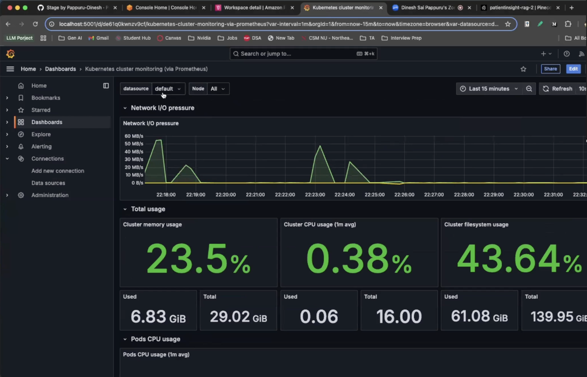
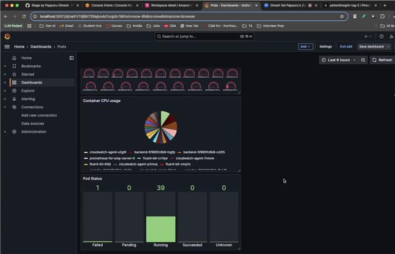
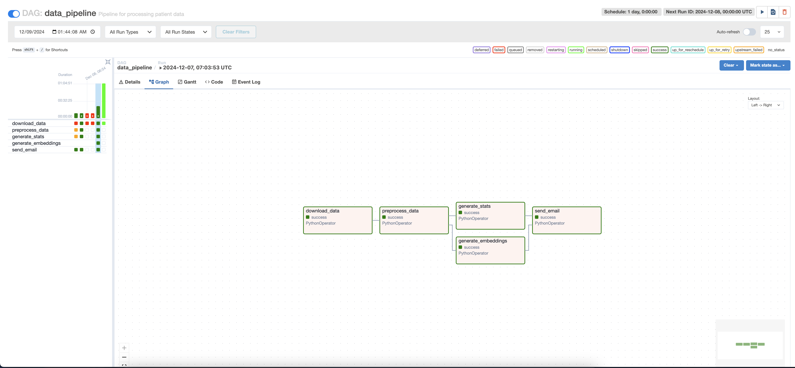
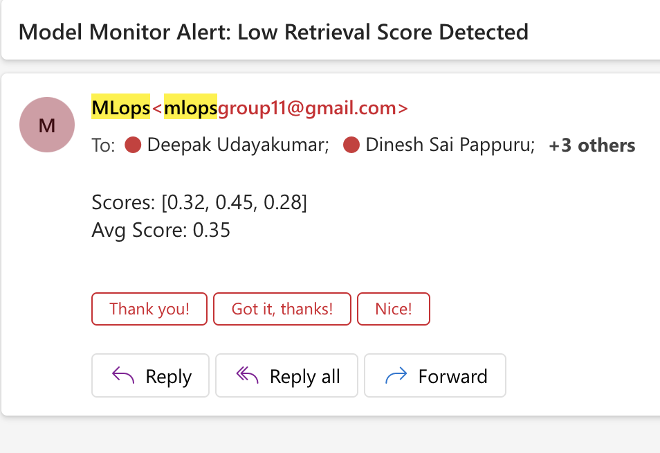
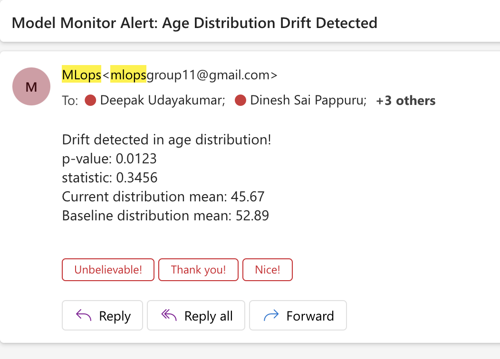

# PatientInsight: Cloud Deployment Architecture Report

### Video Submission Link: https://drive.google.com/drive/folders/19H8RAABVZ1dCw0p4YTw2ry5hKUAxjPj8?usp=sharing

### Ml Pipeline Readme: https://github.com/theamiteshtripathi/PatientInsight/blob/stage/backend/ml_pipeline/README.md

## Executive Summary
PatientInsight is deployed as a cloud-native solution leveraging Amazon Web Services (AWS) as the primary cloud provider. This deployment strategy enables scalable, reliable, and secure delivery of our medical symptom analysis pipeline.

## Cloud Infrastructure Overview

### Deployment Environment: Cloud-Based Solution
PatientInsight is implemented as a cloud deployment, utilizing AWS's comprehensive suite of services to create a robust and scalable architecture.

### Cloud Provider: Amazon Web Services (AWS)

#### Core Services Utilized
1. **Storage and Data Management**
   - Amazon S3
     * Primary storage for datasets
     * DVC data repository
     * Artifact storage
   - Amazon RDS
     * Relational database management
     * Persistent data storage

2. **Machine Learning Infrastructure**
   - Amazon SageMaker
     * MLflow experiment tracking and model registry
     * Pre-trained LLM deployment
     * Inference endpoint management

3. **Containerization and Orchestration**
   - Amazon Elastic Container Registry (ECR)
     * Docker image repository
     * Container versioning
   - Amazon Elastic Kubernetes Service (EKS)
     * Kubernetes cluster management
     * Pod orchestration
     * Node scaling
     * Deployment management

4. **Serverless Computing**
   - AWS Lambda
     * Automated DAG triggers
     * Event-driven pipeline execution

5. **Compute Resources**
   - Amazon EC2
     * Compute instances
     * Application hosting

6. **Monitoring and Logging**
   - Amazon Managed Service for Prometheus
     * Deployment monitoring
     * Performance metrics
   - Amazon CloudWatch
     * Centralized logging
     * System monitoring

This cloud-based architecture provides the foundation for our healthcare analytics system, ensuring high availability, scalability, and robust security measures while maintaining operational efficiency.

## Deployment Replication Guide

### Prerequisites Setup

This are all the prerequisites that you need to setup before deploying the cloning this repository and running the deployment script which does not require any manual intervention.

#### 1. AWS Account and CLI Configuration
```bash
# Install AWS CLI
curl "https://awscli.amazonaws.com/awscli-exe-linux-x86_64.zip" -o "awscliv2.zip"
unzip awscliv2.zip
sudo ./aws/install

# Configure AWS CLI
aws configure
# Enter your AWS Access Key ID
# Enter your AWS Secret Access Key
# Region: us-east-2
# Output format: json
```

#### 2. Required Tools Installation
```bash
# Install Docker
sudo apt-get update
sudo apt-get install docker.io
sudo usermod -aG docker $USER

# Install kubectl
curl -LO "https://dl.k8s.io/release/$(curl -L -s https://dl.k8s.io/release/stable.txt)/bin/linux/amd64/kubectl"
sudo install -o root -g root -m 0755 kubectl /usr/local/bin/kubectl

# Install eksctl
curl --silent --location "https://github.com/weaveworks/eksctl/releases/latest/download/eksctl_$(uname -s)_amd64.tar.gz" | tar xz -C /tmp
sudo mv /tmp/eksctl /usr/local/bin
```

### Infrastructure Setup

#### 1. Create EKS Cluster
```bash
eksctl create cluster \
    --name patient-insight-eks-cluster \
    --region us-east-2 \
    --node-type c4.xlarge \
    --nodes-min 2 \
    --nodes-max 4 \
    --with-oidc \
    --ssh-access \
    --ssh-public-key your-key-name \
    --managed
```

#### 2. Create ECR Repositories
```bash
# Create repositories for frontend and backend
aws ecr create-repository --repository-name frontend
aws ecr create-repository --repository-name backend
```

### Application Deployment

Here you clone the repository and configure the environment variable, and then run the deployment script **deploy.sh** which does not require any manual intervention.

#### 1. Clone Repository
```bash
git clone https://github.com/your-repo/PatientInsight.git
cd PatientInsight
```

#### 2. Environment Configuration
Create a `.env` file in the root directory:
```env
AWS_REGION=us-east-2
OPENAI_API_KEY=your_openai_key
PINECONE_API_KEY=your_pinecone_key
PINECONE_ENVIRONMENT=your_environment
PINECONE_INDEX_NAME=your_index
AWS_ACCESS_KEY_ID=your_aws_key
AWS_SECRET_ACCESS_KEY=your_aws_secret
```

#### 3. Automated Deployment
```bash
# Make the deployment script executable
chmod +x deploy.sh

# Run the deployment script
./deploy.sh
```

### Validation Steps

The deployment script will output the pods, nodes status(check if that is running fine), along with that it also outputs the frontend and backend URLs which you can use to access the application. 

You can copy the frontend External IP and paste it in the browser to access the application.

### Troubleshooting Guide If you face any issues:

#### Common Issues and Solutions

1. **Pod Startup Issues**
```bash
# Check pod details
kubectl describe pod <pod-name>

# Check pod logs
kubectl logs <pod-name>
```

2. **Service Connection Issues**
```bash
# Verify service endpoints
kubectl get endpoints

# Check service details
kubectl describe service <service-name>
```

3. **Image Pull Errors**
```bash
# Verify ECR authentication
aws ecr get-login-password --region us-east-2 | docker login --username AWS --password-stdin $ECR_REGISTRY

# Check pod events
kubectl get events --sort-by='.lastTimestamp'
```

### Cleanup Instructions
```bash
# Delete services
kubectl delete service frontend-service backend-service

# Delete deployments
kubectl delete deployment frontend backend

# Delete cluster
eksctl delete cluster --name patient-insight-eks-cluster --region us-east-2
```

### Security Considerations
- Regularly rotate AWS access keys
- Use AWS Secrets Manager for sensitive information
- Implement network policies in EKS
- Monitor CloudWatch logs for security events
- Keep all tools and dependencies updated

For additional support or troubleshooting, please refer to our project documentation or create an issue in the GitHub repository.


## Kubernetes Infrastructure and Deployment Architecture

### Overview
The PatientInsight application is deployed on Amazon Elastic Kubernetes Service (EKS), implementing a robust and scalable microservices architecture. This section details our Kubernetes infrastructure configuration, highlighting the deployment strategy and architectural decisions that ensure high availability, scalability, and maintainable operations.

### Container Registry and Image Management


Our containerization strategy leverages Amazon Elastic Container Registry (ECR) for secure and efficient image management. The application architecture is divided into two primary components, each maintained in dedicated repositories:
- A frontend repository housing the user interface components
- A backend repository containing the core application logic and API services

Both repositories are configured with AES-256 encryption, ensuring the security of our container images. The repositories support mutable tags, facilitating our continuous deployment pipeline and enabling rapid iterations of our application components.

### Kubernetes Cluster Architecture


The production environment operates on a dedicated EKS cluster named `patient-insight-eks-cluster`. This cluster represents our commitment to container orchestration excellence, running on Kubernetes version 1.31. The cluster architecture is designed with both performance and cost-efficiency in mind, implementing a sophisticated node group configuration that balances resource availability with operational costs.


Our node group configuration exemplifies this balance:
- We utilize c4.xlarge instances, providing robust computational resources for our containerized workloads
- The cluster maintains a baseline of two nodes while allowing elastic scaling up to four nodes based on demand
- Each node is provisioned with 50 GiB of storage, ensuring ample space for container images and ephemeral storage
- The AMI type (AL2_x86_64) was selected for its stability and comprehensive AWS integration capabilities

### Pod Distribution and Service Architecture


The cluster currently orchestrates 14 pods, distributed strategically across two nodes. This distribution reflects our microservices architecture and includes several key components:

The pod architecture can be categorized into three main groups:

1. **Core Application Services**
   Our application pods are deployed with redundancy in mind, running multiple replicas of both frontend and backend services. This configuration ensures high availability and enables zero-downtime deployments.

2. **System and Infrastructure Services**
   The cluster maintains essential AWS integration services, including load balancer controllers and EBS CSI drivers, facilitating seamless integration with AWS infrastructure services.

3. **Monitoring and Observability Stack**
   We implement a comprehensive monitoring solution through CloudWatch agents, Fluent Bit for logging, and Grafana for metrics visualization, ensuring complete observability of our application stack.


### Service Architecture and Network Communication


The application's networking layer is orchestrated through Kubernetes Services, providing stable networking interfaces for our components:

#### Service Configuration
Our Kubernetes deployment includes three essential services:
- `frontend-service`: A LoadBalancer service exposing the frontend to external traffic
  * External IP: k8s-default-frontend-83b9bf328b-4645da8feaa0ec6e.elb.us-east-2.amazonaws.com
  * Port: 80:30619/TCP
  * Type: LoadBalancer

- `backend-service`: A LoadBalancer service for backend API access
  * External IP: k8s-default-backends-848a823787-ea2281742964f835.elb.us-east-2.amazonaws.com
  * Port: 80:30587/TCP
  * Type: LoadBalancer

- `kubernetes`: The default ClusterIP service
  * Internal IP: 10.100.0.1
  * Port: 443/TCP
  * Type: ClusterIP

#### Inter-Service Communication
The frontend and backend services are configured to enable seamless communication within the cluster. The frontend service communicates with the backend through its internal cluster IP (10.100.246.222), while being accessible to external users through its load balancer endpoint. This architecture ensures:
- Secure internal communication between components
- External accessibility through managed load balancers
- Network isolation where appropriate
- High availability through AWS's elastic load balancing

This service configuration creates a robust networking layer that supports both internal application communication and external user access, while maintaining security and scalability of the overall system.

### Load Balancing Strategy


Our load balancing architecture implements a dual-layer approach using AWS Network Load Balancers:

The frontend load balancer (`k8s-default-frontend`) serves as the primary entry point for user traffic, configured as an internet-facing load balancer spanning three availability zones. This configuration ensures optimal distribution of incoming traffic and maintains high availability through zone redundancy.

The backend load balancer (`k8s-default-backends`) manages internal service communication, implementing sophisticated health checking mechanisms and cross-zone load balancing to maintain service reliability.

### Network Architecture and Security
The network architecture is built on AWS VPC infrastructure, implementing a multi-availability zone deployment strategy. This design ensures resilience against zone failures and optimal latency for end-users. The network configuration spans three availability zones, with dedicated subnets for different aspects of our application infrastructure.

### Scalability and Resource Management
Our infrastructure implements horizontal pod autoscaling and cluster autoscaling capabilities. The node group configuration allows for dynamic scaling between 2 and 4 nodes, with the following characteristics:
- Minimum node count: 2 (ensuring high availability)
- Maximum node count: 4 (allowing for traffic spikes)
- Desired capacity: 2 (optimizing for standard operation)

This configuration enables the cluster to automatically scale based on demand while maintaining cost efficiency during periods of lower utilization.

### Monitoring and Observability
The deployment includes a comprehensive monitoring stack:
- CloudWatch integration for metric collection and log aggregation
- Fluent Bit for efficient log forwarding
- Grafana dashboards for metric visualization
- Custom health checks and readiness probes for service monitoring

This robust monitoring setup ensures operational visibility and enables proactive issue resolution.

### Prometheus Implementation


We utilize Amazon Managed Service for Prometheus for metrics collection and storage, configured through a dedicated workspace (ws-16414bce-3756-40fc-8f4f-218915a2a049). The service automatically scrapes metrics from our EKS cluster, including:
- Pod performance metrics
- Node resource utilization
- API endpoint response times
- Custom application metrics
- Model inference latencies

### Grafana Dashboards





Our Grafana implementation provides intuitive visualization of system metrics through custom dashboards:

1. **Kubernetes Cluster Overview**
   - Node resource utilization
   - Pod health status
   - Container metrics
   - Network performance

2. **Application Performance**
   - API response times
   - Request rates
   - Error rates
   - Service latencies

3. **Model Performance**
   - Inference times
   - Model throughput
   - Memory usage
   - GPU utilization

### Integration Points
The monitoring stack is fully integrated with our infrastructure:
- Direct metric collection from EKS cluster
- Custom metric endpoints for application monitoring
- Automated alerting based on defined thresholds
- Real-time visualization of system health

This comprehensive monitoring solution ensures complete visibility into our system's operational status while enabling quick identification and resolution of potential issues.

### Conclusion
Our Kubernetes infrastructure represents a well-architected solution that balances scalability, reliability, and operational efficiency. The combination of strategic pod distribution, sophisticated load balancing, and comprehensive monitoring creates a resilient platform capable of supporting our healthcare application's demanding requirements while maintaining security and performance standards.


## Automated Data Processing with AWS Lambda


### Overview
Our project implements an automated data processing pipeline using AWS Lambda, designed to streamline the handling of new medical datasets. This serverless solution automatically triggers our data processing workflows whenever new data is uploaded to our S3 storage bucket, ensuring continuous updates to our medical analysis system.

### Lambda Function Implementation
The core of our automation is a Lambda function that monitors our S3 bucket for new dataset uploads. When new medical data arrives, the function automatically initiates our Airflow DAG (Directed Acyclic Graph), which orchestrates the entire data processing pipeline. This event-driven approach eliminates the need for manual intervention in our data processing workflow, ensuring immediate handling of new information.

### Data Processing Workflow



Upon triggering, the Lambda function initiates a series of data processing steps through our Airflow pipeline. The workflow begins with comprehensive data preprocessing, where the raw medical data is cleaned, standardized, and validated. Following this, the pipeline generates statistical analyses and reports, providing insights into the new dataset's characteristics and quality metrics.

### Vector Database Integration


The final stage of our automated pipeline involves generating embeddings for the processed medical data. These embeddings are crucial for our medical analysis system, as they enable efficient similarity searches and case comparisons. The Lambda function ensures that all new data is properly vectorized and stored in our Pinecone vector database, maintaining the system's ability to provide accurate medical insights.

### Security and Monitoring
Our Lambda implementation adheres to AWS security best practices, operating with minimal required permissions through a carefully configured IAM role. The function's activities are monitored through CloudWatch, providing detailed logs and metrics that help maintain system reliability. This monitoring ensures that any processing issues are quickly identified and addressed, maintaining the integrity of our medical data processing pipeline.

### Conclusion
The integration of AWS Lambda in our data processing pipeline represents an efficient, automated approach to handling medical data updates. This serverless architecture ensures that our medical analysis system remains current with minimal operational overhead, while maintaining high standards of data processing and security.

## Amazon SageMaker

### Overview
Our project leverages Amazon SageMaker for model serving(Pretrained model which does not require finetuning or retraining) and experiment tracking, focusing on the deployment of our specialized medical interaction model (OpenBioLLM) and comprehensive MLflow integration. This infrastructure supports our medical analysis pipeline, where users can interact with generated doctor reports through a sophisticated question-answering system.

### Model Deployment Strategy


We deploy OpenBioLLM, a Llama-based model fine-tuned on biomedical data(This is a pretrained model from hugging face and we are not finetuning it), through SageMaker's managed endpoints. The deployment process involves packaging the pre-trained model, configuring the endpoint for optimal performance, and establishing auto-scaling policies to handle varying loads. Our endpoint configuration utilizes ml.g4dn.xlarge instances with auto-scaling capabilities, ensuring cost-effective yet responsive model serving.

### Model Versioning and Tracking


The system integrates with SageMaker's managed MLflow service for comprehensive experiment tracking and model versioning. Each model configuration and deployment is tracked through MLflow, with artifacts stored in S3 buckets. This integration enables version control of model configurations, monitoring of deployment performance, and systematic tracking of model interactions. The MLflow dashboard provides insights into model performance metrics, making it easier to maintain and optimize our deployment over time.

### Integration Architecture
The deployment integrates seamlessly with our larger pipeline, where doctor reports generated from our RAG system are stored and versioned in MLflow. Users can query these reports through the deployed OpenBioLLM endpoint, receiving medically-contextualized responses. This architecture ensures reliable model serving while maintaining comprehensive tracking of all model interactions and configurations.


## Deployemnt Automation through Continuous Integration and Deployment Pipeline

### Overview
Our project implements a sophisticated CI/CD pipeline using GitHub Actions, ensuring automated testing, building, and deployment of our healthcare application components. This automation pipeline is defined in two key workflow files: `.github/workflows/continuous_integration.yml` for testing and `.github/workflows/continuous_deployment.yml` for deployment, creating a seamless path from development to production.

### Continuous Integration Process
Our CI pipeline automatically triggers on pull requests to the staging branch, specifically monitoring changes in the backend directory. The pipeline executes comprehensive testing of both ML and data components:

The ML pipeline testing encompasses multiple critical areas:
- Retrieval validation ensuring accurate case matching
- Bias metric evaluation for fairness in medical responses
- Integrated pipeline testing for end-to-end functionality
- Environment variable validation for secure configuration

The data pipeline testing validates:
- Data download processes
- Preprocessing functionality
- Data quality checks

Each test execution is monitored, with automated email notifications sent to the team indicating success or failure, enabling quick response to any issues that arise during the integration process.

### Continuous Deployment Strategy
The deployment pipeline, triggered automatically on pushes to the main branch from the staging branch, handles the deployment of both frontend and backend components to our EKS cluster. The process includes:

1. **Container Image Building**
   - Automated building of Docker images for both frontend and backend
   - Push to Amazon ECR with versioning
   - Platform-specific builds (linux/amd64) for compatibility

2. **Kubernetes Deployment**
   - Automatic update of EKS cluster configuration
   - Rolling deployment to ensure zero-downtime updates
   - Service configuration and load balancer setup
   - Health check validation

3. **Notification System**
   - Automated email notifications for deployment status
   - Detailed reporting of success/failure for each component
   - Team-wide communication of deployment results

This automated pipeline ensures that our medical analysis system remains current and reliable, with minimal manual intervention required for updates and deployments. The process maintains high standards for testing and deployment while providing comprehensive monitoring and notification systems for the development team.


## Model and Data Drift Monitoring

**Since we will be using a pretrained model, we will not be able to retrain the model if there is a model decay. We will be using the pretrained model to generate doctor reports and we will be monitoring the data drift and retrieval performance.**

So by retrival performance, we mean the performance of the RAG system. We set a threshold of 0.5 for the retrieval score. If the retrieval score is below 0.5, we will be sending an alert to the team. We also have a lambda fucntion that generates the embeddings and stores it in the vector database whenever the new data is uploaded to the S3 bucket.

More details about the monitoring system can be found below: 

### Overview
Our healthcare chatbot system implements robust monitoring strategies to ensure reliable performance and early detection of potential issues in the production environment. The monitoring system focuses on two critical aspects: data drift detection and retrieval performance monitoring, complemented by an automated data pipeline for continuous improvement.

### Data Drift Detection Strategy

### Age Distribution Monitoring
Our primary data drift detection mechanism focuses on monitoring the age distribution of incoming patients. The system maintains a baseline distribution derived from our training dataset (PMC-Patients dataset) and continuously compares it with the current patient population using the Kolmogorov-Smirnov test. This statistical approach helps identify significant shifts in patient demographics that could impact model performance.

When the KS test returns a p-value below 0.05, indicating a significant deviation from the baseline distribution, the system automatically triggers an alert. This early warning system enables proactive investigation of demographic shifts and their potential impact on model recommendations.

### Retrieval Performance Monitoring
The system's RAG (Retrieval-Augmented Generation) component is monitored through continuous analysis of retrieval scores. These scores indicate how well the system matches current patient cases with similar historical cases in our knowledge base. Low retrieval scores might indicate:
- Previously unseen medical conditions
- Edge cases not well-represented in our training data
- Potential gaps in our knowledge base

The monitoring system tracks both average and minimum retrieval scores, triggering alerts when scores fall below configured thresholds (currently set at 0.5). This helps maintain high-quality medical recommendations and identifies areas where the knowledge base might need enhancement.

### Automated Data Pipeline and Continuous Learning

Our system features an automated data pipeline implemented through AWS Lambda functions. When new medical data is uploaded to our S3 bucket, the pipeline automatically:
1. Triggers preprocessing of the new data
2. Generates embeddings for the processed information
3. Updates the Pinecone vector database with new embeddings

This automation ensures that our knowledge base remains current and continuously improves as new medical cases are added. The Lambda function's event-driven architecture provides a scalable and maintenance-free solution for data updates.

### Alert System and Response Protocol





The monitoring system uses a sophisticated email-based alert mechanism that notifies relevant stakeholders when:
- Significant data drift is detected
- Retrieval scores fall below acceptable thresholds
- Data pipeline processing encounters issues

Alerts include detailed information about the detected issues, including:
- Statistical measures of detected drift
- Specific retrieval scores that triggered the alert
- Timestamp and context of the issue

### Continuous Improvement

The system implements several triggers for model retraining consideration:
1. Significant age distribution drift (p-value < 0.05)
2. Consistently low retrieval scores
3. Substantial new data accumulation (>20% of original training data)

These triggers help maintain optimal model performance and ensure the system evolves with changing patient populations and medical knowledge.


### Model Performance Monitoring

#### RAG Retrieval Quality
We implement continuous monitoring of retrieval scores to ensure relevant case matching:
- Threshold-based monitoring (minimum score: 0.5)
- Automated alerts for low-similarity retrievals
- Tracking of retrieval score distributions
- Integration with MLflow for metric logging

#### Automated Embedding Updates
Our system already maintains freshness through automated processes:
- Lambda function triggers for new data processing
- Automatic embedding generation and storage
- Seamless integration with Pinecone vector database
- Real-time updates to the retrieval system
- With the new embeddings, we will be able to generate more accurate doctor reports as the retrival score might improve.

### Implementation Benefits
1. **Continuous Adaptation**
   - New medical cases automatically embedded
   - Vector database constantly updated
   - No manual retraining required

2. **Quality Assurance**
   - Regular monitoring of retrieval quality
   - Age distribution drift detection
   - Automated alert system

3. **System Reliability**
   - Pre-trained model stability
   - Fresh, relevant embeddings
   - Consistent performance tracking

This monitoring approach ensures system reliability while leveraging the strengths of our pre-trained models and automated embedding updates.


## Logging and Monitoring Infrastructure


### Overview
Our application implements comprehensive logging through Amazon CloudWatch, providing centralized log management and monitoring capabilities across all components of our healthcare system. The logging infrastructure captures detailed operational data from our EKS cluster, Lambda functions, and SageMaker endpoints, enabling real-time monitoring and troubleshooting of our medical analysis pipeline.

### CloudWatch Implementation
CloudWatch serves as our primary logging solution, collecting logs from multiple sources within our architecture. As shown in the CloudWatch console, we maintain distinct log groups for different components, including `/aws/eks/PatientInsightEKSCluster/cluster` for Kubernetes operations, `/aws/lambda/airflow_trigger` for our automated data processing, and `/aws/sagemaker/Endpoints/Llama3-OpenBioLLM-8B-patientInsight-endpoint` for model inference monitoring. This structured approach to log management ensures easy access to component-specific information while maintaining a comprehensive view of system operations.

### Log Management Strategy
Our logging strategy emphasizes automated collection and retention of operational data. CloudWatch agents deployed across our infrastructure automatically gather logs from application containers, system components, and AWS services. These logs are retained according to defined policies, with critical system logs kept for extended periods to support long-term analysis and compliance requirements. The logging system captures various operational aspects, including application performance metrics, error traces, and system health indicators.

### Monitoring and Alerting
The CloudWatch infrastructure not only collects logs but also enables proactive monitoring through custom metrics and alerts. We've configured automated notifications for critical events such as deployment failures, model performance degradation, or system errors. These alerts are integrated with our notification system, ensuring that the development team can respond quickly to any operational issues that arise in our medical analysis system.